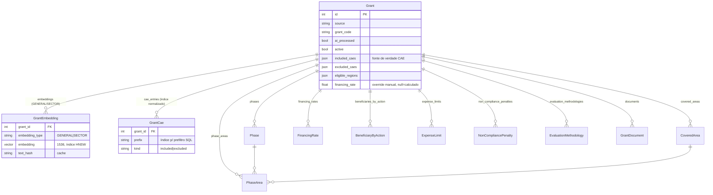

# MatchGrants

Plataforma que faz *scraping* de avisos de financiamento (Portugal2030, Compete2030, PRR),
extrai deles dados estruturados com uma pipeline de IA (OpenAI) e cruza empresas — identificadas
pelo **NIF** — com os apoios a que são elegíveis.

O núcleo é um **motor de matching** que, dado um NIF, obtém os dados da empresa (API nif.pt +
enriquecimento local), filtra os avisos ativos por elegibilidade rígida (CAE, localização,
dimensão, tipo de beneficiário), ordena os elegíveis por relevância semântica (embeddings) e
passa os melhores por uma camada final de validação por LLM.

---

## Arquitetura

- **Django** (Python 3.13) servido por **gunicorn**.
- **PostgreSQL + [pgvector](https://github.com/pgvector/pgvector)** — base principal (`default`).
  Guarda os avisos e os *embeddings* (vetores de 1536 dim.), com índice **HNSW** para procura
  semântica.
- **SQLite** (`nif`) — base secundária, só-leitura, de **enriquecimento por NIF** (nº de
  trabalhadores, proveitos, dimensão pré-calculada). Router dedicado (`match/routers.py`).
- **Docker Compose** — sobe a app + Postgres com a extensão pgvector.
- Integrações externas: **nif.pt** (dados do contribuinte), **CTT** (código postal → localidade),
  **OpenAI** (extração + embeddings), **OpenRouter** (LLM de validação, modelo gratuito).

### Apps

| App | Responsabilidade |
|-----|------------------|
| `avisos` | Avisos (`Grant`) e tabelas-filhas; scraping (Portugal/Compete/PRR); pipeline IA (P1–P7); embeddings; edição; serviço de PDFs. |
| `match` | Motor de matching: nif.pt, elegibilidade (`scoring_rules`), relevância semântica, validação LLM. |
| `anuncios` | Anúncios de contratação pública (`Notice`) + embeddings próprios. |
| `users` | Perfis (`UserProfile`), papéis (admin/commercial_grants/commercial_public/client/viewer), permissões. |
| `common` | Utilitários partilhados: normalização de texto (`text`), datas (`dates`), CAE (`cae`), paginação (`pagination`), ficheiros (`files`). |

---

## Modelo de dados (ER)

`Grant` é a raiz. Os dados **lidos em bloco** (indicadores, despesas, critérios…) ficam em
**JSONB** no próprio `Grant`; o que o **match consulta/filtra** está **normalizado** em
tabelas-filhas com índices. Ver o porquê em [DECISIONS.md](DECISIONS.md).



`UserProfile` (app `users`) liga-se 1–1 ao `auth.User` e guarda o NIF, papel, CAE e localização.
`NifCompany` (base `nif`, SQLite) é a tabela de enriquecimento, com chave = NIF.

---

## Pipeline de matching (`NifMatchingService.evaluate`)

```
NIF ─▶ nif.pt (+ enriquecimento SQLite + CTT)  ─▶ metadados do cliente
     ─▶ 1. PREFILTRO SQL (GrantCae)   — só avisos CAE-candidatos saem do Postgres
     ─▶ 2. FILTRO RÍGIDO (Python)     — CAE · localização · dimensão · tipo de beneficiário
     ─▶ 3. RELEVÂNCIA semântica       — 0.60 setorial + 0.40 geral (embeddings, cosseno)
     ─▶ 4. ORDENAÇÃO                  — relevância › taxa efetiva › dotação efetiva
     ─▶ 5. VALIDAÇÃO LLM (top-10)     — remove os não adequados; degrada em silêncio se falhar
```

Passos-chave:
- **Prefiltro SQL** — a tabela derivada `GrantCae` deixa o Postgres devolver só os avisos sem
  restrição de CAE **ou** cuja inclusão bate num prefixo do cliente. Resultado **idêntico** ao de
  filtrar tudo em Python, mas sem carregar os incompatíveis. (`GrantCae` é mantida em sincronia
  com os JSONB `included_caes`/`excluded_caes` por um *signal* — ver `avisos/signals.py`.)
- **Índice parcial** `grant_active_processed_idx` (`WHERE ai_processed AND active`) — indexa só o
  conjunto quente (~1–2 k avisos ativos), pelo que o match é insensível ao histórico inativo.
- **Validação LLM** — só os 10 mais relevantes vão ao LLM (limita custo/latência); sem chave ou
  em falha, nada é filtrado.

---

## Como correr

```bash
# 1. Variáveis de ambiente (ver .env.example se existir; mínimo abaixo)
#    DJANGO_SECRET_KEY, DEBUG, ALLOWED_HOSTS, OPENAI_API_KEY,
#    NIF_KEY (+ NIF_KEY1..4 opcionais), OPENROUTER_API_KEY, EMAIL_* (opcional)

# 2. Subir Postgres + app
docker compose up -d --build

# 3. Migrações
docker compose exec app python manage.py migrate

# 4. (opcional) carregar o enriquecimento por NIF para o SQLite
docker compose exec app python manage.py load_nif_dictionary

# 5. Testes
docker compose exec app python manage.py test
```

## Endpoints principais

Especificação completa (todas as rotas, todos os métodos, corpo dos pedidos/respostas) em
**[docs/openapi.yaml](docs/openapi.yaml)** — navegável em `/docs/` (Swagger UI) com a app a
correr.

As rotas de `avisos` e `anuncios` seguem a **mesma forma**, propositadamente — cada app tem um
único recurso "raiz" (aviso / anúncio) com o mesmo conjunto de ações:

| Ação | avisos | anuncios |
|------|--------|----------|
| Listar (paginado, filtros, `?q=`, `?order_by=`) | `GET /avisos/list/` | `GET /anuncios/list/` |
| Opções dinâmicas dos filtros | — | `GET /anuncios/filters/` |
| Detalhe | `GET /avisos/<id>/` | `GET /anuncios/<id>/` |
| Editar | `PUT/PATCH /avisos/<id>/edit/` | `PUT/PATCH /anuncios/<id>/edit/` |
| Documento(s) | `GET /avisos/<id>/document/` | `GET /anuncios/<id>/document/cadernoEncargos/`, `GET /anuncios/<id>/document/programaConcurso/` |
| Disparar ingestão (scrape/import) | `POST /avisos/` (todas as fontes), `POST /avisos/compete/`, `POST /avisos/portugal/`, `POST /avisos/prr/` | `POST /anuncios/` (`?num_days=`, 15 por omissão) |

Outras rotas:

| Método | Rota | Descrição |
|--------|------|-----------|
| POST | `/match/evaluate-nif/` | Match de um NIF → avisos elegíveis ordenados. |
| POST | `/match/promote/<nif>/` | Promove um *viewer* (lead) a *client* (admin/commercial_grants/commercial_public). |
| GET | `/planned-grants/` | Avisos previstos (Plano Anual) a partir de hoje, paginados/ordenáveis. |
| GET | `/planned-grants/sync/` | Sincroniza o Plano Anual a partir do Excel oficial. |
| GET | `/news/weekly/` | Newsletter semanal (novos/atualizados avisos+anúncios, próximos avisos). |
| — | `/users/…` | Gestão de utilizadores/perfis. |

---

## Testes

Suite em `*/tests.py` (297 testes). As integrações externas (OpenAI, nif.pt, OpenRouter) são
sempre *mockadas* — os testes não fazem chamadas de rede. *Linting* com **ruff** e cobertura via
GitHub Actions (`.github/workflows`).

## Decisões de arquitetura

As escolhas não óbvias — JSONB vs tabelas, normalização seletiva do CAE, índice parcial, camada
LLM, embeddings especializados, rotação de chaves — estão documentadas como ADRs em
**[DECISIONS.md](DECISIONS.md)**.
